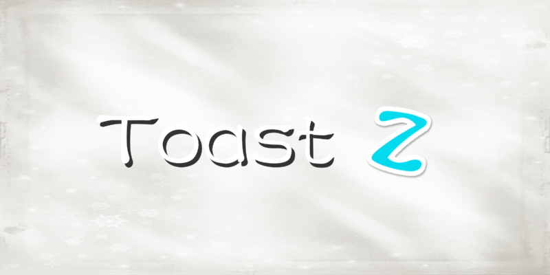

# ToastZ

>ToastZ is a customizable Toast. It is quite individual, concise and powerful. Please read the document and source code for details.

<h2>Pictures show</h2>

   

<h2>Document</h2>

- [English](https://github.com/duyangs/ToastZ/wiki/English-document)

- [中文](https://github.com/duyangs/ToastZ/wiki/%E4%B8%AD%E6%96%87%E6%96%87%E6%A1%A3)

<h2>Open source libraries used in the project</h2>

- [Toasty](https://github.com/GrenderG/Toasty)
